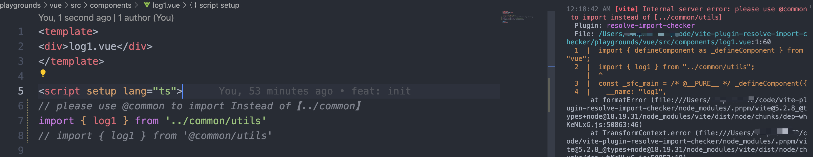
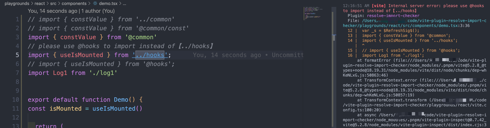
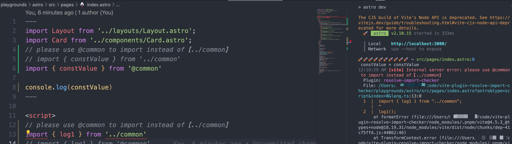

<p align="center">
<h1 align="center">vite-plugin-alias-import-checker</h1>
</p>

<div align="center">
  一个用来检查是否通过 `alias` 而不是相对路径 引入的 vite 插件

[![NPM version][npm-image]][npm-url] ![NPM downloads][download-image]

![Test][test-badge] 

<!-- ![codecov][codecov-badge] -->


[npm-image]: https://img.shields.io/npm/v/vite-plugin-alias-import-checker.svg?style=flat-square
[npm-url]: http://npmjs.org/package/vite-plugin-alias-import-checker


[download-image]: https://img.shields.io/npm/dm/vite-plugin-alias-import-checker.svg?style=flat-square


[test-badge]: https://github.com/baozouai/vite-plugin-alias-import-checker/actions/workflows/ci.yml/badge.svg

[codecov-badge]: https://codecov.io/github/baozouai/plugin-vite-plugin-alias-import-checker/branch/master/graph/badge.svg


</div>

中文 | [English](./README.md)

## 🔥 Features


> 更多用法，请看[示例](#-例子)

## 📦  安装

```sh
pnpm add vite-plugin-alias-import-checker -D
# or
yarn add vite-plugin-alias-import-checker -D
# or
npm i vite-plugin-alias-import-checker -D
```
## ⚙️ 参数

```ts
interface Options {
  
}
```

 ## 🔨 使用

```ts
import { defineConfig } from 'vite'
import aliasImportChecker from 'vite-plugin-alias-import-checker'

const config = defineConfig({
  plugins: [
    aliasImportChecker(),
  ],
})

export default config

```

## 👇 例子

拉项目后通过运行启动playgrounds：
```shell
pnpm play # 对应vue
# 或者
pnpm play:react # 对应react
play play:astro # 对应astro
```

来启动项目

具体配置可以看 [vue/vite.config.ts](./playgrounds/vue/vite.config.ts) 或者 [react/vite.config.ts](./playgrounds/react/vite.config.ts)、[astro.config.mjs](./playgrounds/astro/astro.config.mjs)


> 
> 
> 

## 📄 协议

vite-plugin-alias-import-checker 遵循 [MIT 协议](./LICENSE).