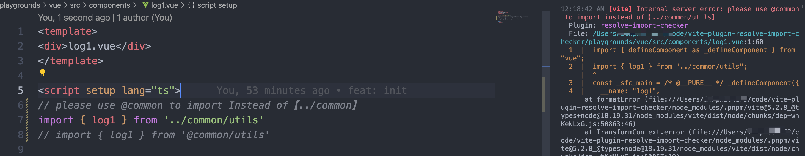

<p align="center">
<h1 align="center">vite-plugin-alias-import-checker</h1>
</p>

<div align="center">
  a vite plugin designed to validate and ensure the correctness of alias imports in your project.

  

 [![NPM version][npm-image]][npm-url] ![NPM downloads][download-image]

![Test][test-badge] 

<!-- ![codecov][codecov-badge] -->


[npm-image]: https://img.shields.io/npm/v/vite-plugin-alias-import-checker.svg?style=flat-square
[npm-url]: http://npmjs.org/package/vite-plugin-alias-import-checker


[download-image]: https://img.shields.io/npm/dm/vite-plugin-alias-import-checker.svg?style=flat-square


[test-badge]: https://github.com/baozouai/vite-plugin-alias-import-checker/actions/workflows/ci.yml/badge.svg

[codecov-badge]: https://codecov.io/github/baozouai/plugin-vite-plugin-alias-import-checker/branch/main/graph/badge.svg


</div>

English | [中文](./README-zh_CN.md)

## 🔥 Features

- Support different files ——  👉 .js, .jsx, .ts, .tsx, .vue, .svelte, and .astro
- support error level: error | warn
  
> for more usage please see the [examples](#-example)

## 📦  Install

```sh
pnpm add vite-plugin-alias-import-checker -D
# or
yarn add vite-plugin-alias-import-checker -D
# or
npm i vite-plugin-alias-import-checker -D
```


## ⚙️ Options

```ts
interface Options {
  /** default error */
  level?: 'warn' | 'error'
}
```
##  🔨 Usage

```ts
import { defineConfig } from 'vite'
import aliasImportChecker from 'vite-plugin-alias-import-checker'

const config = defineConfig({
  plugins: [
    aliasImportChecker(),
  ],
})

export default config

```

## 👇 Example

Clone the project and start playgrounds by running:

```shell
pnpm play # corresponding to vue
# or
pnpm play:react # corresponds to react
pnpm play:astro # corresponds to astro
```


For specific configuration, see [vue/vite.config.ts](./playgrounds/vue/vite.config.ts) or [react/vite.config.ts](./playgrounds/react/vite.config.ts), [astro.config.mjs](./playgrounds/astro/astro.config.mjs)

> 
> 
> 


## 📄 License

vite-plugin-alias-import-checker is [MIT licensed](./LICENSE).